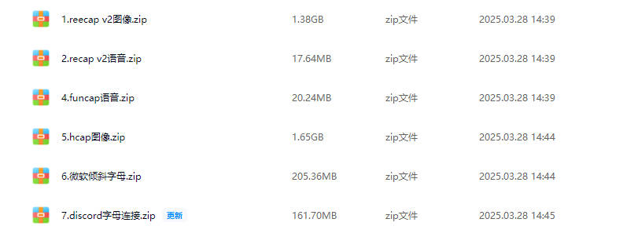

# 声明：本教程只能用于教学目的，如果用于非法目的与本人无关

# --------------- 广告 ---------------

## 本人24个实战视频教程，后续会更新十几个，每个教程都有配套的数据样本，训练代码，成品模型，推测代码，2k出售，有问题可以随时问，详情联系本人：tomysky67




## 试看视频 顶象空间推理.mkv 链接: https://pan.baidu.com/s/1ly-wmD5GMHpwTb2PpF8-ww?pwd=6666 提取码: 6666

# --------------- 广告 ---------------

# recap九宫格
# 详细的视频讲解地址：https://www.bilibili.com/video/BV1wA7FzAEeZ/?vd_source=4e60c6c3075c23c4aef0f545b39459b8
## 1.分析


> ​		根据提示文字，找出对应的物体所在的图片位置。提示文字比较大，我们可以把提示文字和它对应的物体作为一个分类进行训练。
>
> ​		3 3九宫格这个图，因为每一个小图，你检测出分类，那么这个小图就算你需要点选的。但是4 4的就不行，这你检测出的物体分类因为矩形框的原因，会导致不是你需要的图分区也被占用了。
>
> ​		今天讲3 3 yolo目标检测方案，yolo11x.pt做迁移训练。

## 2.目标检测


> ​	把图片里出现的所有类别分别做目标检测。比如桥，汽车，出租车，公交车，楼梯等等。用中文做分类名会出问题，用英文或者拼音作为分类名都是ok的。


**target.yaml**

```yaml
train: train/images # train images (relative to 'path') 128 images
val: val/images # val images (relative to 'path') 128 images

nc: 18
names: ["qiao", "zonglvshu", "renxinghengdao", "xiaofangshuang", "honglvdeng", "zixingche", "xiaojiaoche", "yancong", "louti", "jidongche", "tuolaji", "bus", "school_bus", "motuo", "chuzuche", "tingchejishiqi", "chuan", "shan"]

```

**train.py**

```python
from ultralytics import YOLO

def train_model():
    # 加载YOLOv11模型
    model = YOLO('yolo11x.pt')  
    # 开始训练
    model.train(
        data='./target.yaml',  # 数据集的配置文件
        epochs=600,                        # 训练的轮数
        imgsz=640,                         # 输入图像的尺寸
        batch=16,                          # 批处理大小
        device='0',                        # 使用的GPU设备编号
        patience=600
          )

    # 评估模型
    model.val()

    # 导出模型
    model.export(format='onnx')  # 你可以选择其他格式，如'onnx', 'coreml', 'tflite', 等等

if __name__ == '__main__':
    import multiprocessing
    multiprocessing.freeze_support()  # 确保在Windows系统上正确启动多进程
    train_model()
```

## 3.加载训练好的模型做预测

> ​		首先用yolo检测目标，用分割y的坐标上的类别作为参考的类别分出来。然后找y参考坐标以下的，跟参考类别一样的就是我们需要的类别。最后根据目标类别的中心点所在的分割图的区域确定我们需要点的位置。

**yolo预测代码**

```python
import os
import random
import uuid
import cv2
from tqdm import tqdm
from ultralytics import YOLO

def predict_and_draw_boxes(image_path, model, save_result=False, output_path='output.jpg'):
    # 读取图像
    image = cv2.imread(image_path)
    # image = cv2.resize(image,(640,640))
    if image is None:
        print(f"Error: Image at {image_path} could not be loaded.")
        return

    # 进行预测
    results = model(image)

    # 解析和显示结果
    boxes = results[0].boxes.xyxy  # 获取所有预测框的坐标
    classes = results[0].boxes.cls  # 获取所有预测框的类别
    confidences = results[0].boxes.conf  # 获取所有预测框的置信度

    for i, box in enumerate(boxes):
        x1, y1, x2, y2 = map(int, box)  # 转换为整数坐标

        class_id = int(classes[i].item())  # 类别ID

        confidence = confidences[i].item()  # 置信度
        if confidence<0.5:
            continue
        centre_x = (x1 + x2)/2
        centre_y = (y1 + y2)/2
        print("centre point:",(centre_x,centre_y))
        cv2.rectangle(image, (x1_expanded, y1_expanded), (x2_expanded, y2_expanded), (255, 255, 0), 2)  # 绘制矩形框
        label = f'{model.names[class_id]} {confidence:.2f}'
        cv2.putText(image, label, (x1, y2 + 15), cv2.FONT_HERSHEY_SIMPLEX, 0.5, (255, 0, 0), 2)

    # # 显示结果图像
    cv2.imshow('Prediction', image)
    cv2.waitKey(0)
    cv2.destroyAllWindows()


if __name__ == '__main__':
    model_path = 'best.pt'  # 替换为你的模型路径
    model = YOLO(model_path)
    base_dir = "images"
    files = os.listdir(base_dir)
    for file in tqdm(files):
        filename = os.path.join(base_dir, file)
        print(filename)
        predict_and_draw_boxes(filename, model)

```


